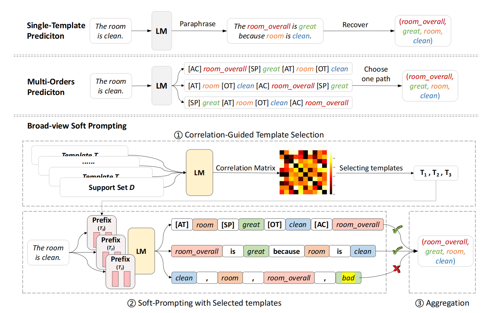
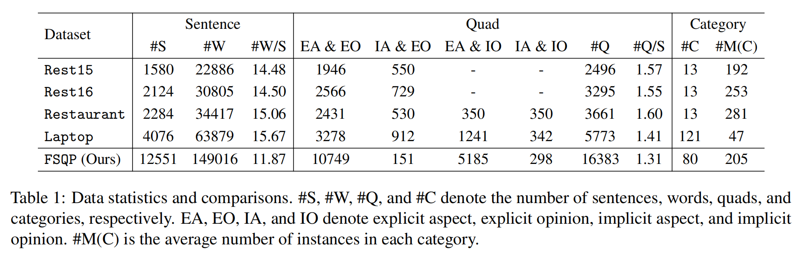
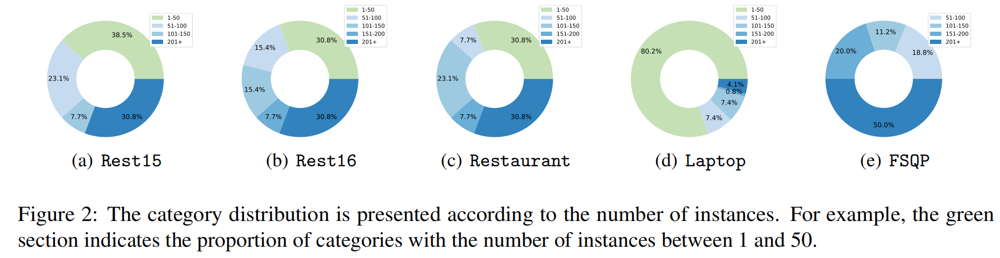
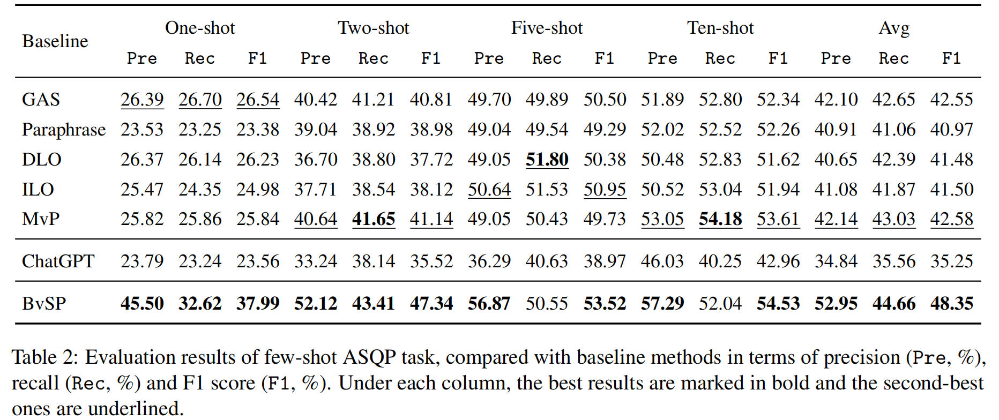
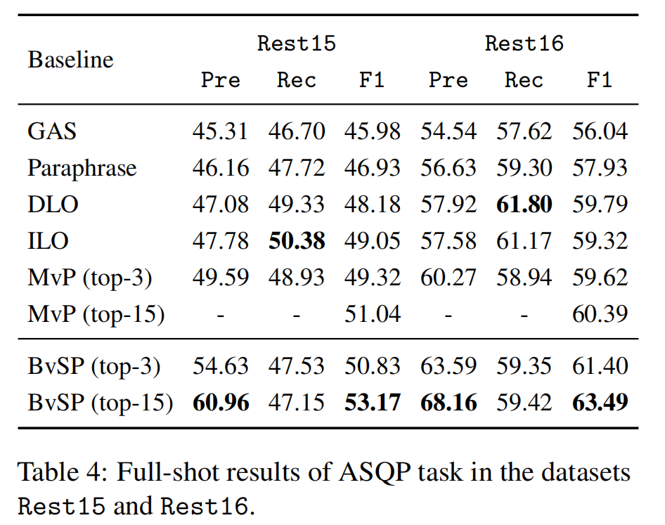

<h1 align="center">
BvSP: Broad-view Soft Prompting for Few-Shot Aspect Sentiment Quad Prediction
</h1>

<p align="center">
  <a href="#-Introduction">Introduction</a> • 
  <a href="#-Results">Results</a> • 
  <a href="#-quick-start">Quick Start</a> • 
  <a href="#-Core-Code">Core Code</a>
</p>

## ✨ Introduction 

We construct a few-shot ASQP dataset ($\mathtt{FSQP}$) and propose Broad-view Soft Prompting (BvSP).

- BvSP, a **various templates-based soft prompt learning** method that improves quad prediction by taking into account the correlation between the different templates.

<p align="center">
    
</p>


- A new **few-shot ASQP dataset $\mathtt{FSQP}$** contains richer categories and is more balanced for the few-shot study. To the best of our knowledge, this is the first work to explore the few-shot ASQP problem.


<p align="center">
    
</p>
<p align="center">
    
</p>
## 🎯 Results

Experimental results under four few-shot settings (i.e. one-shot, two-shot, five-shot, and ten-shot) demonstrate that **BvSP outperforms strong baselines and has significant gains in other public datasets.**

### Evaluation on $\mathtt{FSQP}$
Under the same few-shot settings, BvSP demonstrates superior performance compared to MvP. These results validate the effectiveness of BvSP in providing a broader view of templates.

<p align="center">
    
</p>


### Evaluation on Other Datasets
BvSP continues to outperform all baselines in the full-shot setting. It is worth noting that BvSP exhibits superiority over MvP in both the top-3 and top-15. This underscores that BvSP not only excels in few-shot scenarios but also proves beneficial in full-shot scenarios.

<p align="center">
    
</p>

## 🚀 Quick Start


### ⚙️ Setup

```sh
conda create -n bvsp python=3.8
conda activate bvsp
torch==1.11.0
transformers==4.14.1
pytorch_lightning==0.8.1
numpy==1.21.2
```

### ⚡️ Training

To obtain the training model:

- Pre-Train models:

```sh
bash scripts/pretrain.sh
```

- Train in few-shot settings

```sh
bash scripts/run.sh
```

## 🤖 Core Code

### Jensen-Shannon (JS) divergence

```
BvSP/js.py
```

### Soft Prompting

Data processing
```
BvSP/data_utils.py: line 271
```

Model init and freeze parameters
```
BvSP/model.py: line 117~127
```

Model forward
```
BvSP/model.py: line 263
```

<!-- ## ☕️ Citation

If you find this repository helpful, please consider citing our paper:

```

``` -->